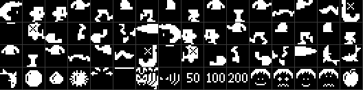
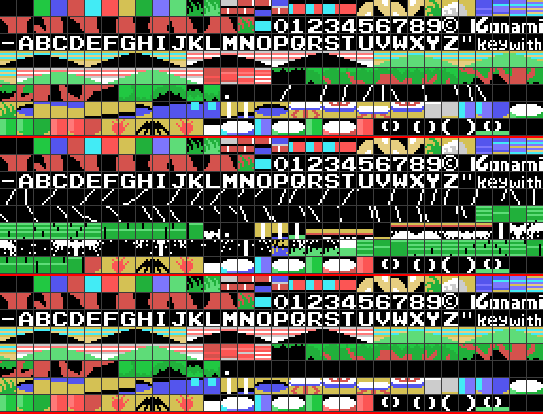

# The code

## Everything happens inside the interrupt

The main program is two bytes: `jr $` at 0x40A7. The game runs in the H.KEYI
hook, which the BIOS calls on every screen refresh, and which always does the
same three things (0x4038):

    785D   the sound, always, even if the last frame never finished
    40B3   the controls, only with a game in progress
    412A   one step of the game: the state in 0xE000

and nothing else. There is no main loop to come back to.

## The call that never comes back

Jumps to computed addresses are a routine of their own here, 0x40A9, and it
uses a trick that shows up all over the cartridge: **the table sits right
behind its own `call`**.

```asm
DESPACHA:
    add a,a                   ; 40a9
    pop hl                    ; 40aa   the return address IS the table
    call HL_MAS_A             ; 40ab
    ld e,(hl)                 ; 40ae
    inc hl                    ; 40af
    ld d,(hl)                 ; 40b0
    ex de,hl                  ; 40b1
    jp (hl)                   ; 40b2
```

The `pop hl` takes the return address, which is where the table starts, indexes
it and jumps. It never returns to whoever called it. Five tables are used that
way:

| Table | How many | What it picks |
|---|---|---|
| 0x4149 | 20 | the state of the game |
| 0x41F8 | 2 | the two steps of the menu |
| 0x5C7F | 4 | which of the four skies is drawn |
| 0x5E85 | 4 | which combination of treetops goes on top |
| 0x66C2 | 17 | what the player is doing |

Because the table is data sitting in the middle of the code path, a static
tracer walks straight into it. That is what `src/athletic.nocode` is for: five
ranges, one per table.

## One routine draws all the scenery

0x5F65 is the only thing that puts a layout on screen, and it takes its
arguments the same way: **six bytes after the `call`**, two pointers and a
video address.

```asm
MOTOR_DE_ROTULOS:
    pop hl                    ; 5f65   the six bytes of parameters
    ld de,0e150h              ; 5f66
    ld bc,00006h              ; 5f69
    ldir                      ; 5f6c
    push hl                   ; 5f6e   carry on after them
```

The list is a run of counts: *n* copies n tiles from the tile list, *n* with bit
7 set fills n positions with a single tile, a lone 0x80 says a new video
address follows, and a zero ends. Nineteen calls, and **four of them write the
colour table** instead of the name table (0x70F0 onwards): the same engine,
pointed at 0x0000 rather than 0x3800.

That is why the tracer needs the `!skip 0x5F65 6` directive: those six bytes
are not instructions, and executing them would derail everything after the
call.

## The frame

0x585E, in order: the 128 bytes of sprite attributes go to video memory in one
copy —all 32 sprites, every frame—; at exactly the twenty-fourth step the
moving obstacles are switched on; and then, only while the player is alive, the
clock, the counters and the eleven things that move, followed by the player
himself.

The counters are the small clever thing. 0xE130 counts frames, and on top of it
four more tick every **8, 9, 10 and 11** frames (0x5FD2). Those four are the
phases: the two vines take the 8 and the 10, and the four water-jet planks take
one each, so the four planks never rise and fall together. And they are the
only thing that survives the screen wipe (0x5A64): walk into a new screen and
the vines are wherever they were.

## The jump is a table read forwards and then backwards

There is no vertical speed anywhere. A jump is a list of deltas between a 0xFE
and a 0xFF, walked in one direction **subtracting** —going up, less and less
each frame— and in the other **adding** (0x61B7). Hitting the 0xFF turns it
round; coming back to the 0xFE ends the jump.

The normal jump is these sixteen bytes at 0x6CF5:

    4 4 3 3 3 3 2 2 2 2 1 1 1 1 0 0

Sixteen frames up and sixteen down, 32 pixels of rise, and the fall is the rise
read the other way: exactly symmetrical, because it is the same bytes. There
are four such lists, and everything that leaves the ground uses one:

| | |
|---|---|
| 0x6CF5 | the normal jump, a bounce with no button, falling off a plank or a post |
| 0x63C9 | the high bounce off a trampoline, and the bouncing ball |
| 0x63A5 | a ball that rolls in high hops |
| 0x63B7 | a ball that rolls almost flat |
| 0x6CE3 | sinking, and a ball in between |

The player's curve is walked one delta per frame, and while he is in the air
the same routine also checks whether he has touched the end of a vine (0x6C3C).

## The player is four sprites and a shadow

An MSX1 sprite is one colour, so the boy is four: two on top —head and body, in
red and yellow— and two underneath —the legs, in magenta and blue—. The pose
0xE136 indexes the table at 0x6B8A, fourteen records of four patterns: 0 to 6
facing right, 7 to 13 the same facing left.

Under him, sprite 8: the same X, pattern 0xD4, black. It sits at Y 0x8C while
he is on the ground or hanging from a vine, disappears while he is in the air,
and follows sixteen points under him while he is up on a trampoline, a plank, a
post or the log — which is what tells you where you are.

Here are the 64 sprite patterns, rebuilt from video memory as the cartridge
loads it. The right-facing 23 are drawn in the cartridge and the next 23 are
those same ones mirrored bit by bit at load time; the last 18 are everything
else — the fish, the balls, the spider, the shadow, the 50/100/200 labels, the
four faces and the fruit. They come out white on black because the colour is
not in the pattern: the game writes it into the attribute record.



## The tiles, three thirds of them

In graphics mode 2 each third of the screen has its own bank, and the cartridge
uses them as three different tile sets. This is the pattern table with its
colours, rebuilt by replaying the cartridge's own copies: the font sits in all
three thirds —it is loaded once and copied twice—, the scenery goes wherever it
is going to be drawn, and the middle third carries the vines and the water
jets.



## The water jet is eighteen drawings and a nineteenth byte

The plank that rides the water jet is not moved: it is redrawn. 0x56DD is a
table of eighteen pointers, and each one points at nineteen bytes: a block of
6×3 tiles, and then **one more byte, the height of the plank** — 0x52 at the
bottom down to 0x32 at the top, two at a time. 0x60B7 draws the block and
returns that byte, which is what the player then stands on.

The phase runs 0 to 31: from 18 upwards it is read backwards, so eighteen
drawings make a full up-and-down.


## The sound never touches the chip more than it must

Three channels, ten bytes of state each, from 0xE010: how many frames of the
note are left, its length, which sound is playing, the pointer into its track,
how many octaves down, and the volume with its envelope.

Asking for a sound is calling 0x77FE with a number. Under 0x8E it is an effect
and takes channel C alone; 0x8E is the in-game music and takes A and B; from
0x90 up it takes all three. The number itself is the priority: a new sound only
displaces a lower one (0x781C). The table at 0x796A holds 34 pointers, the
channels of each sound side by side.

The player reads two formats, told apart by bit 7 of the sound number:

| | |
|---|---|
| effect | `0x2n` sets the note length, then two bytes: volume and a 12-bit period |
| music | `0xFD oo` sets the octave and the starting volume, then one byte per note: length in the high nibble, note in the low one, 12 meaning silence |

`0xFE` restarts the track —that is how the in-game music loops— and `0xFF`
switches the channel off. Only the music carries an envelope: the note starts
at its volume, drops three steps in three frames, holds, and drops two more at
the end.

One sound is a joke on the rest: **number 6 is a track that only contains
0xFF**. It is asked for when the bee flies off the screen and when you leave a
screen, and all it does is switch the effects channel off — the only way to
stop the buzzing.
