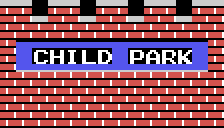
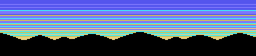
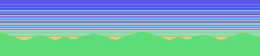
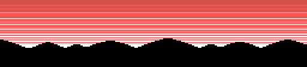
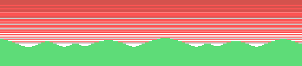
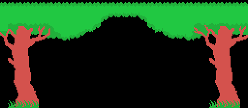
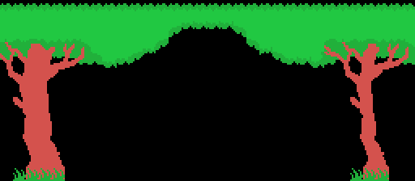
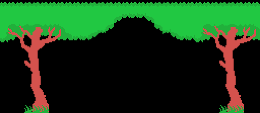
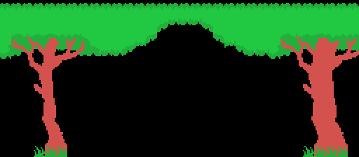

# The game

A boy runs across a park jumping over what is in the way, against a clock.
Everything on this page comes from reading the code that does it.

## The world is a counter and a table of thirty-two screens

The screen you are on is the byte at 0xE054, SCENE, and it is a plain counter,
not a map. When you walk off the edge, state 16 (0x43C0) steps it: **plus one**
if you left by the side you were heading for, **minus one** if you turned back.
Going down from 1 it sticks at 1 and flips the direction (0x43E0); going up
past 255 it drops to **56** (0x43F2). The scoreboard shows it in BCD at the
bottom right.

What is on that screen does not come from SCENE itself but from **SCENE modulo
32** (0x5B8F), used as an index into two tables of thirty-two bytes:

| | |
|---|---|
| 0x5C32 | the fixed obstacles, one byte per screen, into 0xE156 |
| 0x5C52 | the moving ones, one byte per screen, into 0xE158 |

That is the whole map of the game: sixty-four bytes.

| bit | 0x5C32 — what is built | 0x5C52 — what moves |
|---|---|---|
| 0 | five puddles, in a row | how many balls roll (bits 0-2) |
| 1 | two vines | |
| 2 | four trampolines, with a fruit above | |
| 3 | four water jets with a plank on top | spiders that drop from above |
| 4 | the pond of five posts | fish |
| 5 | the rock | the floating log |
| 6 | the campfire | the bouncing ball |
| 7 | the pond | the bee |

## Every screen ending in 0, 4 or 8 comes out empty

The stage number then edits the pair. First 0x5BA4 looks at SCENE in BCD and,
if the last digit is 0, 4 or 8, wipes the fixed obstacles and keeps only the
bee out of the moving ones. Then the stage (0xE051, kept in BCD):

| stage | what it takes out |
|---|---|
| 1 | the spiders and the bee |
| 2 | nothing; and the bee is pinned to the highest of its four heights |
| 3 | the bee |
| 4 and up | nothing; and on an even stage, if the screen came out completely empty, it puts the bee back |

The screens whose number ends in 0 get wiped a second time, by 0x5E58, which
also draws the **CHILD PARK** sign: those are the entrance —SCENE 0— and the
finishing lines.

The bee's height is one of four, at 0x64A4: 0x38, 0x48, 0x58 and 0x72. Which
one is not stored anywhere and is not a sequence: every time the bee leaves the
screen, 0x6452 reads the **Z80's own refresh register** and keeps two bits of
it. Only on stage 2 is it fixed, and then to the highest of the four —the one
that flies over your head—.

## The backdrop is picked by two bits of SCENE

The obstacles come from the tables; the backdrop does not. Before anything is
placed, 0x5BF2 chooses between two. If bit 1 of SCENE is set **and** the screen
has no vines, no trampolines and no spiders, it draws a sky: six rows of bands
over a line of hills, one of four picked by bits 2 and 3 (0x5C72).

Otherwise it draws the normal one (0x5E71): a strip of grass on row 15 and, at
the top, a canopy of leaves with a trunk on each side. Each half comes in two
shapes —sloped or level— and bits 1 and 2 of SCENE pick which pair goes up.

Either way the ground of rows 16 to 19 goes in afterwards (0x5CEA), and only
then are the obstacles placed on top of it, one call each, in the order the
bits are read.

## A stage is ten screens

0xE05A holds the goal, in BCD, and it starts at 10. Reaching a SCENE that ends
in 0 and matches that goal (0x692C) —crossing X 0xC8 going right, or dropping
below X 0x28 going left— sounds the fanfare and hands the player to state 7,
which is six half-turns on the spot and then the stage is over.

Then 0x438B: one more life, the stage plus one in BCD, the goal ten screens
further on, and the clock refilled. What is left of the clock is cashed in at
**200 points a chunk**, four frames at a time, while the music finishes
(0x435E). Clearing stage 99 wraps it round to 00 (0x4295) and prints ALL STAGE
CLEAR with the credits.

## The moving obstacles do not start at once

They start **twenty-four steps in**. The frame routine (0x586A) watches the
step counter 0xE13B and, exactly when it reaches 24, copies 0xE158 into 0xE159,
which is the byte the balls, fish, spiders, bee and bouncing ball actually
look at. Walk into a screen and nothing chases you for the first two dozen
steps.

From state 7 upwards the player is dying, and then not one of the eleven
obstacle routines is called (0x587A): the screen freezes and only the player
moves.

## What everything is worth

Points are cashed by walking past a thing, not by touching it: 0x6623 sweeps a
list of X positions and, when the player has left one behind, adds it once and
floats the number over his head for thirty frames. They are stored as BCD
nibbles —0x05, 0x10, 0x20—:

| | |
|---|---|
| 50 | each rolling ball |
| 100 | each post, each trampoline, each puddle, the campfire, the rock, the bee |
| 200 | the fruit, each water-jet plank, the floating log |

The score is six BCD digits and stops dead at **999999** (0x4669), and so does
the high score. A new life is given at 10000 and then every 20000 (0x4677);
once past the last threshold there are no more. Finishing a stage is worth a
**BONUS SCORE 2000** printed on row 12 (0x4299).

You start with three lives and one is spent each time you go in (0x4271), so a
game is three goes. They are drawn twice over: as up to four 2×2 blocks on row
21, and as four face sprites which change expression —normal, worried, happy,
crying— through 0x6699.

## The clock is 58 chunks and it does not kill

0xE055 starts at 0x3A and drops one chunk every 256 frames (0x65AD). The bar
runs from column 30 leftwards along row 1, one tile per four chunks, with three
half-full tiles in between. Below 0x10 the four faces turn worried and it beeps
every 64 frames.

And at **2 it stops** (0x65D1). The clock never runs out on you: it just stays
there with the bar empty. Nothing in the code kills the player for running out
of time.

## What kills

Four ways, and only four:

- **a collision.** 0x6A41 checks the player's head (sprite 4) and legs (sprite
  6) against the fish, the rolling balls, the spiders, the bee and the bouncing
  ball; the legs are also checked against sprite 31, the invisible box —colour
  0x10— that the rock and the campfire put in front of themselves. The fruit
  (sprite 19) is in the same sweep but is worth 200 points and a sound;
- **the water.** Standing over the pond (0x689B), or landing on the pond of
  posts or the trampoline pit (0x676A), sinks you: state 15, the crying faces,
  and the player goes down a step of the sinking curve every eight frames;
- **stepping into a puddle**, which drops you two points further on and into
  the same sinking (0x68AE);
- **a fall.** Not the height you land at: the height you fell **from**. See
  [Findings](FINDINGS.html).

Dying does not repaint the screen: every obstacle sprite is hidden (0x68DC),
the player turns over and over for 128 frames (0x69D8), and the state machine
moves on.

## The controls, and the four ways to play

Four directions and two buttons, in joystick format in 0xE009, with the
previous frame kept in 0xE008 so that "just pressed" can be told from "held".
The keyboard is read straight off the PPI —row 8 for the cursors and the space
bar, row 7 for SELECT— and shuffled bit by bit into that same shape (0x40CB),
so nothing downstream can tell which you are using.

On the title screen, keys 1 to 4 pick how to play (0x40F7), through an
eight-byte table at 0x4122: one player with joystick, two with joystick, one
with keyboard, two with keyboard. With two players, 32 bytes of state are
simply swapped when the turn changes (0x4329).

## The demo plays itself, but it is not recorded

The attract mode runs the game with a handful of rules instead of a recording
(0x58B2). On screen 0 it runs right and jumps at X 0x38 and X 0x80. On screen 1
it looks at what the player is doing: walking, it turns round past X 0xB0 and
otherwise jumps at random —reseeding the frame counter from the Z80's own R
register—; hanging from a vine, it lets go when the counter wraps; riding the
log, it jumps when it reaches the edge.

It only has two screens: reaching SCENE 2 sends it back to the title (0x4408).
