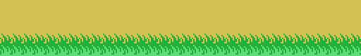

# El cartucho

16384 bytes. Sin cargador y sin bloques: el MSX mapea el cartucho en
0x4000-0x7FFF —la página 1— y ese es el mapa de memoria entero, sin solapes:
ninguna dirección significa dos cosas distintas en dos momentos distintos.

## Por dónde entra

Los dieciséis primeros bytes son la cabecera que lee la BIOS:

    41 42 77 40 00 00 00 00 00 00 00 00 00 00 00 00
    'A' 'B'  \_ INIT = 0x4077

Las dos letras marcan un cartucho ejecutable; de los cuatro vectores solo está
puesto INIT —STATEMENT, DEVICE y TEXT, los de BASIC, van a cero—.

## Lo que hace el arranque

INIT (0x4077), por orden:

- `di`, modo de interrupción 1 y la pila en 0xE400;
- borra 0xE000-0xE3FF de un `ldir` (0x407D), que es donde va a vivir todo el
  estado;
- escribe `jp 0x4038` en el gancho H.KEYI, 0xFD9A —primero el byte 0xC3 y luego
  la dirección (0x408A-0x4094)—;
- echa el candado de 0xE005 mientras prepara el VDP y el PSG (0x44FD) y carga
  la fuente (0x4626);
- suelta el candado, `ei`, y se cae en el `jr $` de 0x40A7.

Esos dos bytes son el programa principal. **El juego entero corre dentro de la
interrupción**, cincuenta o sesenta veces por segundo, y el programa ya no
vuelve.

## El candado

Como el juego es la interrupción, un fotograma que se pase de tiempo se
reentraría a sí mismo. 0xE005 lo impide: el gancho (0x4038) lee el estado del
VDP para bajar la petición, toca el sonido —siempre, antes que nada— y solo
entonces mira el candado. Si está echado, eso es todo lo que hace esa
interrupción (0x4067): la música sigue y al fotograma que aún corre no se le
toca.

## Dónde vive el estado

Todo lo que el juego guarda cabe en el kilobyte que empieza en 0xE000, con la
pila encima, en 0xE400.

| | |
|---|---|
| 0xE000 / 0xE001 | el estado del juego, 0 a 19, y su subestado |
| 0xE002 | las opciones: teclado, dos jugadores, partida en marcha, de quién es el turno |
| 0xE005 | el candado: la interrupción está dentro |
| 0xE008 / 0xE009 | lo pulsado el fotograma pasado y este, en formato de joystick |
| 0xE010-0xE02D | los tres canales de sonido, diez bytes cada uno |
| 0xE038-0xE03F | la copia de los ocho registros del VDP |
| 0xE040-0xE048 | el récord y los puntos de los dos jugadores, en BCD |
| 0xE050-0xE06F | el jugador en juego: vidas, fase, SCENE, tiempo, sentido… |
| 0xE080-0xE09F | la copia del otro jugador, que se intercambia en cada turno |
| 0xE0B0-0xE12F | los 32 atributos de sprite, que suben enteros cada fotograma |
| 0xE130-0xE14F | los contadores y las fases de las lianas y los surtidores |
| 0xE134-0xE13C | el jugador: Y, X, pose, hacia dónde mira, su estado |
| 0xE150-0xE155 | los seis bytes de parámetros que el motor de decorados copia de la ROM |
| 0xE156 / 0xE158 | los obstáculos fijos de esta pantalla y los que se mueven |
| 0xE18C-0xE1AE | las X de los obstáculos y lo que vale cada uno |
| 0xE200-0xE205 | el salto: qué arco, en qué sentido, cuántos fotogramas |

## La pantalla: los colores abajo y los patrones arriba

El VDP se programa con una tabla de ocho bytes en 0x4545, que se copia a 0xE038
y se manda registro a registro (0x4528):

| registro | valor | lo que dice |
|---|---|---|
| 0 | 0x02 | modo gráfico 2 |
| 1 | 0xE2 | 16 KB, pantalla encendida, interrupciones, sprites de 16×16 |
| 2 | 0x0E | la tabla de nombres en 0x3800 |
| 3 | 0x7F | **la tabla de colores en 0x0000** |
| 4 | 0x07 | **la tabla de patrones en 0x2000** |
| 5 | 0x76 | los atributos de sprite en 0x3B00 |
| 6 | 0x03 | los patrones de sprite en 0x1800 |
| 7 | 0xE1 | el borde |

Los colores abajo y los patrones arriba es justo al revés del reparto
habitual, y es la razón de que todas las direcciones de este listado parezcan
descolocadas si se leen esperando el otro.

En este modo la pantalla son **tres tercios**, cada uno con su banco de
patrones y de colores, y el juego lo aprovecha: la fuente se carga una vez y se
copia a los otros dos tercios (0x4583 y 0x4594), mientras que los tiles del
decorado se cargan solo en el tercio donde se van a dibujar. La liana es el
caso más claro: su fila de arriba se dibuja con los tiles 0xB0-0xB6, que están
en el **primer** tercio, y todo lo de abajo con los 0x60-0x9B, que están en el
**de en medio**.

## Cómo están guardados los dibujos

Tres maneras, y cada una para lo que le va:

- **Comprimido**, solo para los dos logotipos. El descompresor es 0x4BB3, 37
  bytes: un cero termina, un byte por debajo de 0x80 repite el siguiente esas
  veces, y un byte de 0x80 en adelante copia esos bytes tal cual. Lleva la
  dirección de destino delante de los datos. Descomprime el logotipo ATHLETIC
  LAND (0x47FB) y el KONAMI grande (0x4BD8), y nada más.
- **Tal cual**, para todo lo que es un patrón: los 48 glifos de la fuente, los
  tiles y los 64 sprites van a la memoria de vídeo de una copia seguida
  (0x454D).
- **Un motorcito**, 0x5F65, para las distribuciones: en vez de guardar una
  pantalla de números de tile, guarda una lista de cuentas —copia n, o rellena
  n posiciones con un solo tile— y los tiles que hay que usar. Diecinueve
  llamadas, y cuatro de ellas escriben la tabla de **colores** en vez de la de
  nombres.

Dos de las llamadas más pequeñas, repetidas aquí: la tira de hierba de la fila
15 (0x5E71) y la tierra de las filas 16 a 19 (0x5CEA). Entre las dos, doce
bytes de parámetros y dos listas cortas.

Las mitades que miran a la izquierda no están guardadas. 0x5A4B le da la vuelta
a los bits de un tile y 0x5A09 hace lo mismo cruzando las dos mitades de un
sprite de 16×16, y las dos corren al cargar: el cartucho lleva 23 sprites y en
la memoria de vídeo hay 46.

## El reparto completo

Ni un byte sin dueño: 7.448 de código alcanzados por el trazador y 8.936 de
datos, cada uno dentro de un rango declarado con la instrucción que lo lee
anotada al lado.

| | |
|---|---|
| 0x4000-0x4010 | la cabecera |
| 0x4010-0x4038 | las primitivas del VDP, y cuatro 0xFF de relleno |
| 0x4038-0x4077 | la interrupción |
| 0x4077-0x4149 | INIT, el bucle principal de dos bytes, el despachador, los mandos y un paso del juego |
| 0x4149-0x4171 | la tabla de veinte estados |
| 0x4171-0x4468 | los veinte estados: título, menú, demo, partida, muerte, game over, fase superada, cambio de pantalla |
| 0x4468-0x44C8 | los créditos, en tiles |
| 0x44C8-0x4626 | partida nueva, arranque del VDP y del PSG, las rutinas de copia y la cortinilla |
| 0x4626-0x4795 | la carga de la fuente, los puntos, las vidas extra, el récord, el marcador y las vidas |
| 0x4795-0x47FB | la pantalla del título y sus columnas |
| 0x47FB-0x48CE | el logotipo ATHLETIC LAND, comprimido |
| 0x48CE-0x4A4E | los 48 glifos de la fuente |
| 0x4A4E-0x4B52 | los rótulos del marcador y las cuatro opciones del menú |
| 0x4B52-0x4BD8 | la carga del logotipo KONAMI y el descompresor |
| 0x4BD8-0x4C6B | el logotipo KONAMI, comprimido |
| 0x4C6B-0x503B | los tiles del juego y sus colores |
| 0x503B-0x555B | los 64 sprites |
| 0x555B-0x56DD | la liana: nueve punteros y nueve dibujos |
| 0x56DD-0x5857 | los surtidores: dieciocho punteros y dieciocho bloques |
| 0x5857-0x5C32 | el fotograma, los mandos de la demo, la carga de gráficos, los espejos y el montaje de la pantalla |
| 0x5C32-0x5C72 | las dos tablas de treinta y dos pantallas |
| 0x5C72-0x5F65 | el decorado: los cielos, el seto, la tierra, el estanque, los obstáculos y la entrada del jugador |
| 0x5F65-0x5FD2 | el motor de decorados |
| 0x5FD2-0x66A6 | los contadores y las once cosas que se mueven, el reloj y los puntos |
| 0x66A6-0x6DD4 | el jugador: diecisiete estados, los choques, sus sprites y los arcos de salto |
| 0x6DD4-0x70A5 | las listas del decorado y los tiles que usan |
| 0x70A5-0x714F | la carga de los patrones y los colores |
| 0x714F-0x77F8 | las listas de color, los colores y los patrones de los tiles |
| 0x77F8-0x77FE | seis bytes sin uso, entre los patrones y el sonido |
| 0x77FE-0x7960 | el sonido: la petición, el reproductor y los dos formatos |
| 0x7960-0x7C3E | los periodos de las notas, la tabla de 34 pistas y las pistas |
| 0x7C3E-0x8000 | el relleno hasta los 16 KB: 962 bytes, todos 0xFF |
