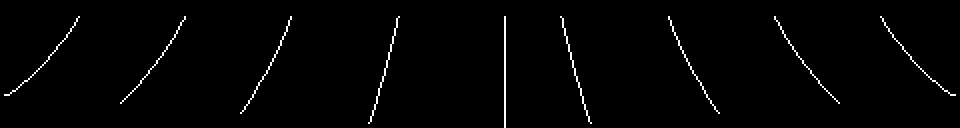

# Hallazgos

Lo que ha salido al desmontar el cartucho, con la prueba al lado. Lo que no
está cerrado está en [Preguntas abiertas](PREGUNTAS-ABIERTAS.html).

## Lo que mata no es la altura a la que caes: es la altura desde la que caíste

No hay daño por caída ni altura mínima en ninguna parte. Lo que hay es un byte:
0xE13A, que se escribe **en el momento de pulsar el botón** (0x6DAA).

Normalmente es la Y desde la que saltaste más dieciséis —dieciséis puntos más
abajo en la pantalla, que saltando desde el suelo es el suelo mismo—. Pero si
saltas estando encima de una de las dos tablas centrales de los surtidores, con
la X entre 0x48 y 0x9F, es la altura de esa tabla, sin sumarle nada.

De ahí en adelante hay dos comprobaciones contra ese byte. Andando, 0x6960 te
mata si tu Y menos 0x11 ha llegado a él; aterrizando en una tabla, 0x656C hace
lo mismo con 0x10. Así que el mismo aterrizaje es inofensivo o mortal según
desde dónde empezara el salto, y saltar desde una tabla alta deja el suelo a
una distancia que mata.

## El mundo son sesenta y cuatro bytes

Ni un mapa ni un generador: dos tablas de treinta y dos bytes, en 0x5C32 y
0x5C52, indexadas por **SCENE módulo 32**. Una dice con qué obstáculos fijos se
construye la pantalla y la otra qué se mueve en ella.

    5C32  03 82 20 04 88 00 01 20 41 10 C0 00 88 40 88 20
          01 04 50 80 50 40 10 20 10 82 00 05 41 88 01 50

    5C52  80 A0 08 08 08 0C 80 0C 10 08 60 08 00 80 18 02
          10 08 48 A0 40 C0 08 09 08 00 01 10 58 10 18 40

El SCENE, en 0xE054, es un contador pelado que sube o baja de uno en uno y, al
pasar de 255, cae a **56** (0x43F2) —no a 0, y no a 1—. Por el otro lado se
queda en 1 y te da la vuelta. Pasadas treinta y dos pantallas el parque se
repite; lo que no se repite es el número de fase, que retoca la pareja antes de
usarla.

## La liana son nueve dibujos, no una animación

No hay interpolación, ni péndulo, ni trigonometría. 0x555B es una tabla de
nueve punteros, y cada uno es un dibujito: tile, tile, y luego 0xFE, 0xFD o
0xFC para bajar una fila —una columna a la izquierda, la misma, o una a la
derecha— y 0xFF para terminar. Ese es el balanceo entero.

El contador de fase va de 0 a 15, y del 9 en adelante se niega y se lee hacia
atrás (0x60D9), así que nueve dibujos hacen la ida y la vuelta. Se pintan dos
lianas por pantalla, doce columnas más allá una de otra, con dos contadores que
corren a ritmos distintos —cada 8 y cada 10 fotogramas—, y por eso no van nunca
a la vez.

Y detrás del 0xFF de cada dibujo van **tres bytes más**: la Y y las dos X del
cabo. Es el único sitio donde el juego sabe dónde acaba la cuerda, y es contra
lo que se comprueban tus manos (0x6C3C).

## La liana está dibujada a caballo de dos bancos de tiles, a propósito

En el modo gráfico 2 la pantalla son tres tercios y cada uno tiene sus propios
patrones. La liana cuelga desde la fila 6 y llega a la 12, así que cruza la
costura entre el primer tercio y el de en medio — y el cartucho carga sus tiles
en consecuencia: el **remate de arriba** de una liana son los tiles 0xB0-0xB6,
copiados al primer tercio (0x594C), y todo lo que va de la fila 8 hacia abajo
son los tiles 0x60-0x9B, copiados al de en medio (0x5940). Ninguno de los dos
juegos existe en el otro banco.

Eso no se ve jugando; sale de poner las direcciones del cargador al lado de los
números de tile de los dibujos.

## Los créditos están dentro del cartucho, en tiles corrientes

En 0x447E, a la vista, con el código de tile siendo el ASCII de la letra:

    ALL STAGE CLEAR
    PROGRAM  A.H  Y.I
    SOUND  Y.O
    CG  R.S  C.K

Se pintan en un solo sitio: 0x445B, cuando el contador de fase da la vuelta de
99 a 00. La lista de distribución que va delante (0x4468) tiene seis entradas
—una raya de 18 tiles en la fila 5, el ALL STAGE CLEAR en la 6, otra raya en la
7, y las tres líneas de créditos en las filas 16, 17 y 18—.

Ni un nombre completo: solo iniciales, y en el cartucho no hay más firma que el
KONAMI 1984 del título y del pie del marcador.

## Dos bytes que son una nota y un puntero a la vez

El reproductor de sonido tiene una tabla de periodos de nota en 0x7960 —diez
bytes— y, pegada detrás, una tabla de 34 punteros a pista en 0x796A. Las dos se
solapan a propósito: la undécima y la duodécima nota, los periodos 60 y 56, son
los bytes `3C 38`, y esos mismos dos bytes son **la entrada 0 de la tabla de
punteros**, que se lee como la dirección 0x383C.

La entrada 0 no se pide nunca —los números de sonido empiezan en 1—, así que no
rompe nada. Se ahorran dos bytes.

## Un sonido que ocupa un byte

El sonido 6 se pide cada vez que la abeja se va de la pantalla y cada vez que
dejas una pantalla, y lo único que hace es callar el canal de efectos: es la
única manera de parar el zumbido de la abeja, que se repite con un 0xFE.

Su pista es el único byte 0xFF de **0x79DB** — que no es una pista: es el 0xFF
con el que acaba el canal A de la fanfarria. Nueve de las 34 entradas de la
tabla apuntan a ese byte: el sonido 6 y los canales que no usa cada sonido de
tres canales.

## La tabla del surtidor lleva su propia altura

Los dieciocho bloques del surtidor (0x5701) son diecinueve bytes cada uno: 6×3
tiles de dibujo, y luego un byte que no se dibuja — la altura a la que queda la
tabla, de 0x52 abajo a 0x32 arriba, de dos en dos.

0x60B7 pinta el bloque y devuelve ese byte, y 0x604B guarda los cuatro en
0xE148-0xE14B. Cuando el jugador aterriza, 0x650E compara su Y contra esos
cuatro números. El dibujo y la física salen de los mismos diecinueve bytes, así
que no se pueden desajustar.

## El rótulo del título se va destapando columna a columna

El logotipo ATHLETIC LAND no es una imagen que se suba entera. Son 34 tiles,
del 0x40 al 0x61, que el descompresor desempaqueta una vez, y luego a 0x47CB se
le llama una vez por fotograma y cada llamada coloca **una columna**: dos
tiles, en las filas 5 y 6, en la columna 8 más las que ya hayan entrado.

Diecisiete llamadas dibujan el logotipo, y el contador sigue hasta 52: las
llamadas de la diecisiete en adelante pintan el KONAMI 1984 de debajo y luego
avisan de que ya no queda nada.

## Lo que sobra dentro del cartucho

Cosas que están y no se usan. Ninguna es una suposición: todas se han buscado.

- **Seis entradas a cero** en la tabla de estados del jugador (0x66C2). Los
  estados 9 a 14 son `0000`, y saltar ahí reiniciaría la máquina. Ninguna
  instrucción escribe un 9 a 14 en 0xE138.
- **Cinco bytes de código que no llama nadie**, en 0x4523: pondrían A en el
  registro 7 del VDP —el borde— y remandarían los ocho registros. Está justo
  delante de la rutina que hace lo mismo sin tocar el borde, y no lo alcanza
  nada.
- **Seis bytes** en 0x77F8, entre el último patrón de tile y el código del
  sonido.
- **962 bytes de 0xFF** desde 0x7C3E hasta el final: el relleno hasta los 16
  KB, y 0xFF en vez de 0x00.
